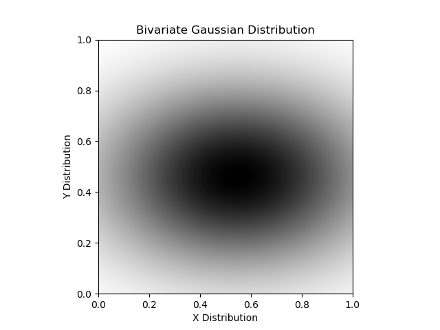
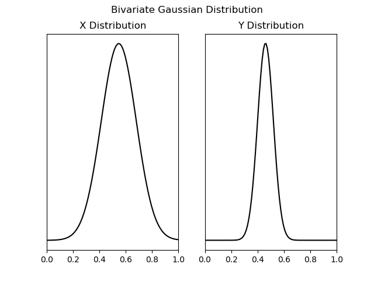

# Assignment 4 - Experimentation

_William M. Temple_

\today

# 1. Design

## Introduction and Procedure

In this experiment, I design and implement an apparatus to test how experiment
participants' recover numerical information from graphical visualizations of
data.  In particular I will compare two visualization strategies for bivariate
Gaussian distributions with independent dimensions
($\rho\sigma_{x}\sigma_{y}=\rho\sigma_{y}\sigma_{x}=0$). In other words, the
bivariate Gaussian distributions have the following form:

$$N((\mu_{x},\mu_{y}),(\sigma_{x},\sigma_{y})$$
$$
V_{xy} =
\begin{bmatrix}
  \sigma_{x} & 0 \\
  0 & \sigma_{y}
\end{bmatrix}
$$

I consider two visualization strategies:

- A single image-plot utilizing a color-map from white to black to show
probability density (Figure \ref{f1}).

{width=4.5in}

- Two separate views each showing the X and Y components of the graphs only (Figure \ref{f2})

{width=4.5in}

The experimental procedure is simple:

1. I will present the participant with some examples of both of these plots,
   one at a time, alternating between image-plot and X/Y subplots.

2. I will then ask the participant to estimate the mean ($\mu$) and
   standard-deviation ($\sigma$) for both the X and Y distributions.

3. I will record the estimated mean and standard-deviation for later analysis.

The experiment will conclude after six iterations of the above procedure per
participant.

## Experiment Overview

In this experiment, I wish to explore whether or not coordinated X and Y
subplots make it easier for a participant to estimate the mean and
standard-deviation of the X and Y components of a bivariate Gaussian
distribution compared to an image map. More specifically, are participants'
estimations of mean and standard-deviation for the X and Y components of a
bivariate Gaussian distribution closer to the actual mean and standard
deviation when the participant is presented with an image map of the joint
distribution or when a participant is presented with two corresponding X and Y
subplots? I hypothesize that the participants will make more accurate
estimations when using the two separate X and Y subplots, as the individual
components may be analyzed independently with less visual interference from the
other competing dimension in the image-plot.

The independent variable is the kind of plot shown to the participant,
either an image-plot or X/Y subplots.  The dependent variables are the distances
between estimated and actual values of $\mu$ and $\sigma$. I will control other
variables to ensure consistency in other aspects of data presentation:

1. Actual probability densities will remain unlabeled, and I will scale the
   means of each distribution in the X/Y subplots so that they match, as the
   image-plot combines the probability densities in the 2D image space.
   Removing axis-labels ensures that noticeable differences in the maximum
   probability density for the X/Y subplots do not affect the estimated mean or
   standard-deviation. Practically, this means that the image-plot has no
   color-bar and the y-axes of the X/Y subplots do not have axis ticks or
   labels, nor do they share a y-axis.

2. In order to avoid any suggestions made by the use of color, all plots will
   use only greyscale.

3. I label the x-axis and y-axis of the image-plot in the same way that I label
   the X and Y subplots, respectively, and the overall graphs are titled
   identically, to avoid any auxiliary effects of word choice.

Due to the small study population I anticipate ($5 < N < 10$), any statistical
significance is unlikely to emerge. However, I will report the participants'
average estimation errors and compute a confidence inteveral for the estimation
error values for each visualization type. I will explain, qualitatively, how
the data do or do not support my hypothesis and whether or not they justify
further experimentation.

# 2. Apparatus

For this experiment, I used an online survey tool (Google Forms) to simplify
data collection. I wrote a Python program (using matplotlib, numpy, and scipy)
to generate figures (like Figure \ref{f1} and \ref{f2}), and embedded them into
the online survey. Each question asks the participant to estimate the mean and
standard-deviation of both the X and Y components of the distribution. The
questions only accept numbers within the inverval $[0,1]$. The full survey text
is embedded below (Appendix A).

# 3. Study and Results

I conducted this experiment with some students in the Laboratory for Playful
Computation and with acquaintances from previous jobs. The size of the data set
is five responses.

# 4. Analysis and Discussion

\includepdf[pages=1, pagecommand={\section{Appendix A}}]{./assets/gform_out.pdf}
\includepdf[pages=2-, pagecommand={}]{./assets/gform_out.pdf}
